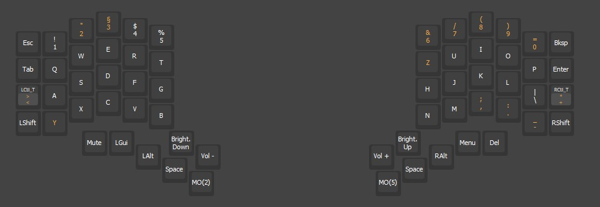

* Keymaps for Elora v1 keyboard

** Configuration

+ Connect your Elora board to your computer
+ Download and install [[https://get.vial.today/][vial]]
+ Start the application and start configuring your keyboard
+ The keys will be updated automatically

#+begin_export latex
  \clearpage
#+end_export

** Layers

#+ATTR_LATEX: :width \textwidth

#+ATTR_LATEX: :width \textwidth
[[file:elora_layer_2.jpg]]
#+ATTR_LATEX: :width \textwidth
[[file:elora_layer_5.jpg]]

** Linux installation

[[https://get.vial.today/manual/linux-udev.html][Instructions]]

#+begin_src bash :results output :shebang #!/usr/bin/env bash
  echo "Install Vial to configure Elora keyboard"
  VIAL_UDEV_FILE="/etc/udev/rules.d/99-vial.rules"
  if [ ! -f "${VIAL_UDEV_FILE}" ]; then
      echo '# splitkb.com Elora
  KERNEL=="hidraw*", SUBSYSTEM=="hidraw", ATTRS{idVendor}=="8d1d", ATTRS{idProduct}=="9d9d", MODE="0660", GROUP="users", TAG+="uaccess", TAG+="udev-acl"' | sudo tee "${VIAL_UDEV_FILE}"
  fi
#+end_src
