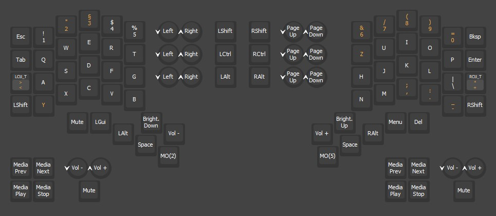
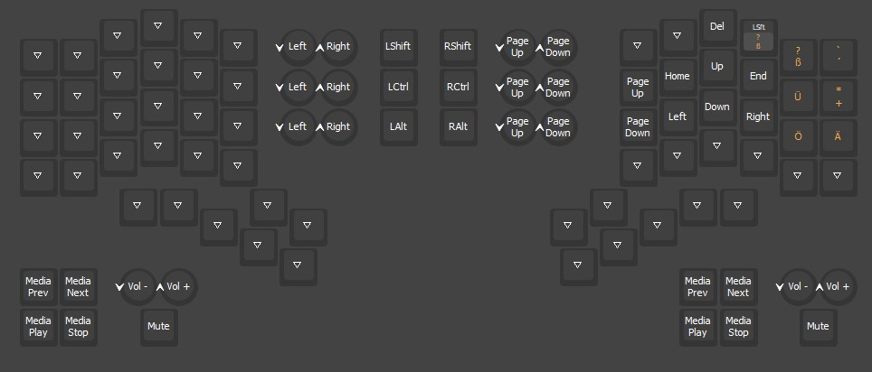
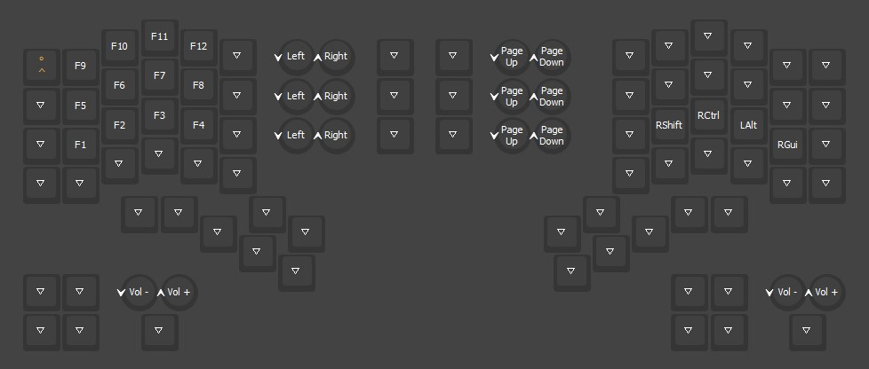

* Keymaps for Elora v1 keyboard

** Configuration

+ Connect your Elora board to your computer
+ Download and install [[https://get.vial.today/][vial]]
+ Start the application and start configuring your keyboard
+ The keys will be updated automatically

#+begin_export latex
  \clearpage
#+end_export

** Layers

#+ATTR_LATEX: :width \textwidth

#+ATTR_LATEX: :width \textwidth

#+ATTR_LATEX: :width \textwidth

